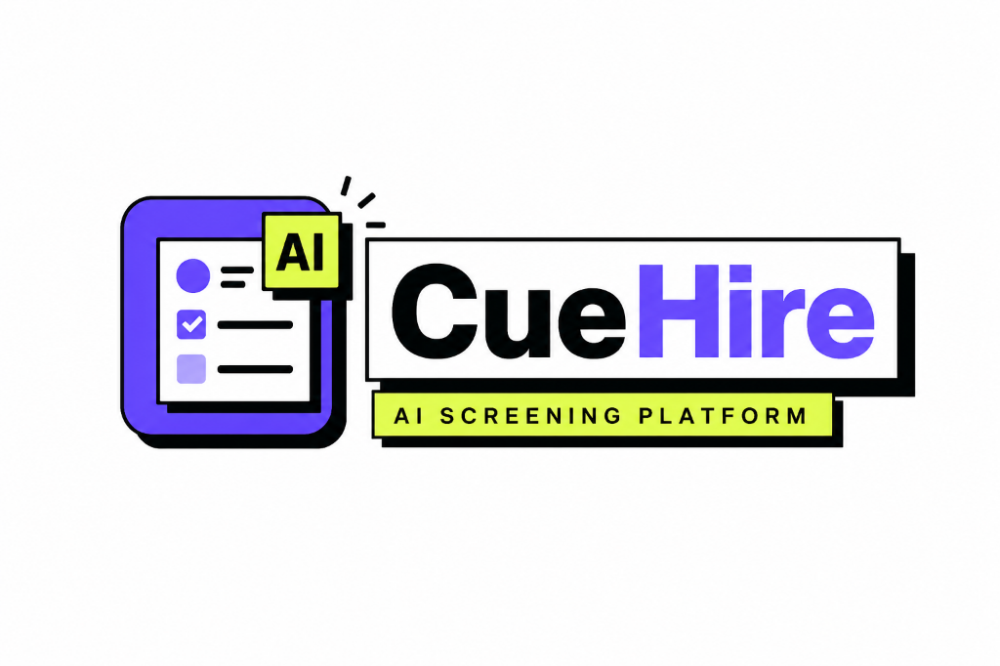
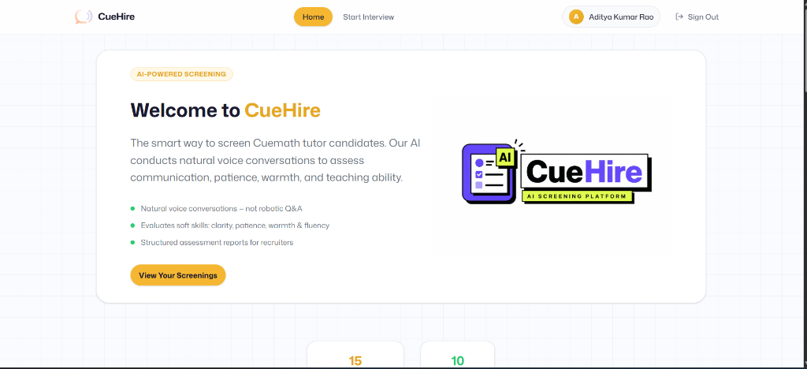
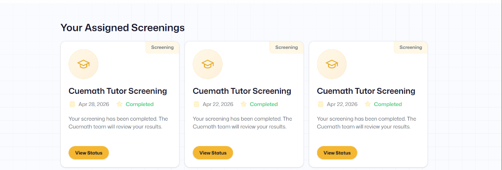
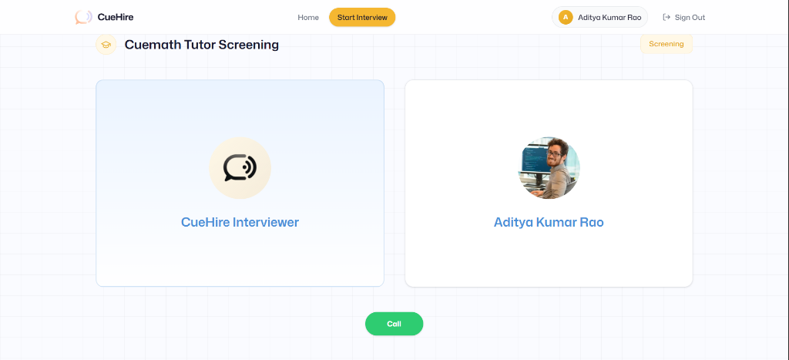
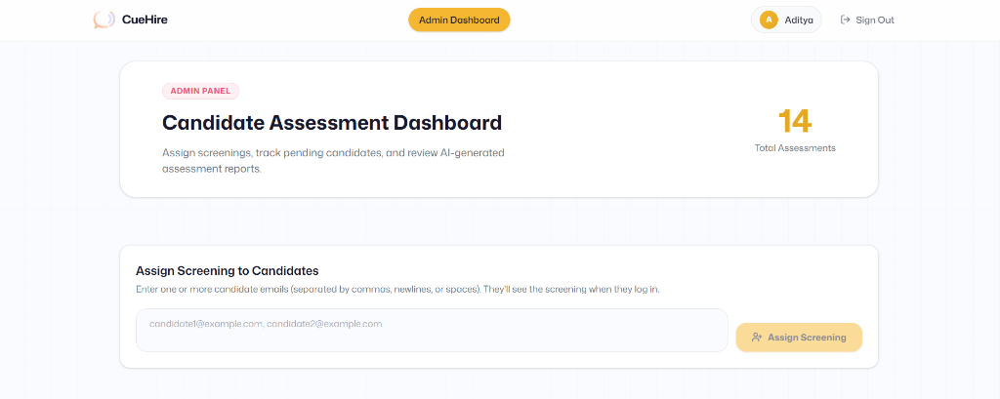
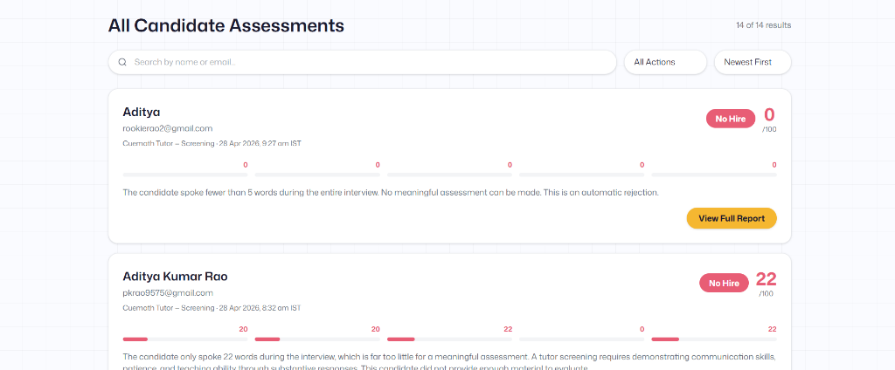

<p align="center">
  
</p>

<h1 align="center">CueHire — AI-Powered Tutor Screening Platform</h1>

<p align="center">
  <strong>Replacing manual recruiter calls with a voice AI that screens, scores, and delivers recruiter-ready reports — in under 10 minutes.</strong>
</p>

<p align="center">
  <a href="https://cue-hire.vercel.app">🔗 Live Demo</a> &nbsp;·&nbsp;
  <a href="#how-it-works">How It Works</a> &nbsp;·&nbsp;
  <a href="#tech-stack">Tech Stack</a> &nbsp;·&nbsp;
  <a href="#architecture">Architecture</a> &nbsp;·&nbsp;
  <a href="#key-decisions">Key Decisions</a>
</p>

<p align="center">
  
  
  
  
  
  
</p>

---

## The Problem

Cuemath screens hundreds of tutor candidates every month. Each must demonstrate soft skills — communication clarity, patience, warmth, and the ability to explain concepts simply to children aged 6–16. The current process:

| Pain Point | Impact |
|---|---|
| **Scale bottleneck** | A single recruiter handles ~15 calls/day. Hundreds of applicants wait in queue |
| **Inconsistency** | Different recruiters weight different traits differently — evaluations aren't comparable |
| **Candidate drop-off** | Days between application and screening call = high abandonment |

**CueHire replaces the entire first-round screening with an AI voice interviewer** that conducts natural conversations and produces structured, evidence-based assessment reports — available to recruiters within seconds of the call ending.

---

## What I Built

A **full-stack production platform** with two distinct user experiences:

### 🎙️ Candidate Experience
A candidate signs up, gets assigned a screening, and enters a **real-time voice interview** with an AI that behaves like a warm, experienced Cuemath recruiter. The AI dynamically adapts — follows up on vague answers, praises strong ones, reassures nervous candidates — making it feel like a real conversation, not a Q&A bot.

### 📊 Recruiter (Admin) Dashboard
Admins get a **command center** to manage the entire screening pipeline:
- **Bulk-assign screenings** to candidates via email
- **Track pending screenings** in real-time
- **Review detailed assessment reports** with 5-dimension scoring, evidence quotes, and hire/no-hire recommendations
- **Search, filter, and sort** candidates by score, recommendation, or date
- **Send formal result emails** with full assessment breakdown directly to candidates

---

## Screenshots

### Candidate Home — Hero & Dashboard
<p align="center">
  
</p>
<p align="center"><em>Clean, branded landing with CueHire logo, feature highlights, and a CTA to view screenings.</em></p>

### Assigned Screening Cards
<p align="center">
  
</p>
<p align="center"><em>Each assigned screening shows role, date, completion status, and a one-click action button.</em></p>

### Live Voice Interview Room
<p align="center">
  
</p>
<p align="center"><em>Real-time voice call with the AI interviewer. Candidate sees the AI agent and a "Call" button to begin.</em></p>

### Admin Dashboard — Assign & Track
<p align="center">
  
</p>
<p align="center"><em>Recruiters bulk-assign screenings via email, see total assessments, and manage the pipeline from one screen.</em></p>

### Candidate Assessments — Search, Filter, Score
<p align="center">
  
</p>
<p align="center"><em>Full assessment list with search, filter by recommendation, score bars per category, and "View Full Report" for deep dives.</em></p>

---

## How It Works

```
Candidate Signs Up → Gets Assigned Screening → Takes Voice Interview (5-8 min)
        ↓                                              ↓
   Firebase Auth                              VAPI + GPT-4 + Deepgram
                                                       ↓
                                              Call Ends → Transcript Captured
                                                       ↓
                                              GPT-4o Analyzes → Structured Assessment
                                                       ↓
                                              Saved to Firestore → Available on Admin Dashboard
                                                       ↓
                                              Recruiter Reviews → Sends Result Email
```

### The AI Interview Pipeline

1. **Voice Call** — VAPI handles WebRTC, VAD, and turn-taking. Deepgram Nova-3 transcribes in real-time. GPT-4 drives the conversation with a detailed system prompt and a curated question bank across 7 categories.

2. **Transcript Capture** — Every utterance is captured client-side. A 2-second buffer after call end ensures no fragments are lost. Transcript is persisted to `sessionStorage` before a hard redirect (intentional — React Router can trigger unmounts that race against the save).

3. **Assessment Generation** — The full transcript is sent to GPT-4o via Vercel AI SDK's `generateObject()` with a Zod schema. This guarantees machine-readable, consistently structured output — no parsing, no surprises.

4. **Anti-Gaming** — Word-count tiers prevent inflated scores. <5 words = automatic 0/100. <30 words = capped at 25/100. The AI evaluator is explicitly told the word count and calibrates accordingly.

---

## The Scoring System

### Five Assessment Dimensions (0–100 each)

| Dimension | What It Measures |
|---|---|
| Communication Clarity | Structure, filler words, clarity for children |
| Patience & Empathy | Acknowledging difficulty, emotional intelligence |
| Warmth & Approachability | Encouraging tone, safe atmosphere |
| Ability to Simplify | Analogies, age-appropriate language, breaking down concepts |
| English Fluency | Grammar, vocabulary, confidence |

### Recommendation Thresholds

| Recommendation | Criteria |
|---|---|
| **Strong Hire** | Total 80+, no category below 70, 200+ words |
| **Hire** | Total 65–79, no category below 55, 150+ words |
| **Maybe** | Total 50–64, mixed signals, 100+ words |
| **No Hire** | Below 50, critical categories below 35, or <100 words |

Every assessment includes **evidence quotes** — the AI cites specific things the candidate said and explains why they support the score. Recruiters don't have to trust a number; they can verify the reasoning.

---

## Tech Stack

| Layer | Technology | Why This, Not That |
|---|---|---|
| **Frontend** | Next.js 15 (App Router), React 19, Tailwind CSS 4 | SSR for fast loads; server components keep API keys off the client; App Router for clean file-based routing |
| **Voice AI** | VAPI | Abstracts WebRTC, VAD, echo cancellation, turn-taking — would take weeks to build from scratch |
| **Speech-to-Text** | Deepgram Nova-3 | Low-latency, high-accuracy, integrated through VAPI |
| **AI Interviewer** | OpenAI GPT-4 | Best-in-class conversational AI for dynamic, natural interview flow |
| **Assessment Engine** | GPT-4o + `generateObject()` + Zod | Structured output with type safety — no regex parsing of free text |
| **Auth** | Firebase Auth | Session cookies (HTTP-only, 1-week expiry) via Admin SDK |
| **Database** | Firestore | Document model fits interview/feedback data naturally; real-time reads |
| **Email** | Nodemailer (Gmail SMTP) | Professional HTML result emails with full assessment breakdown |
| **Deployment** | Vercel | Zero-config for Next.js, edge functions, automatic HTTPS |

---

## Architecture

```
┌─────────────────────────────────────────────────────────────────┐
│                        CANDIDATE FLOW                           │
│                                                                 │
│  Sign Up ──→ Firebase Auth ──→ Home Dashboard ──→ Begin Call    │
│                                                      │          │
│                                              ┌───────▼────────┐ │
│                                              │  VAPI WebRTC   │ │
│                                              │  ┌──────────┐  │ │
│                                              │  │Deepgram   │  │ │
│                                              │  │STT        │  │ │
│                                              │  └──────────┘  │ │
│                                              │  ┌──────────┐  │ │
│                                              │  │GPT-4      │  │ │
│                                              │  │Brain      │  │ │
│                                              │  └──────────┘  │ │
│                                              └───────┬────────┘ │
│                                                      │          │
│                                              Transcript Saved   │
│                                                      │          │
│                                              GPT-4o Assessment  │
│                                                      │          │
│                                              Firestore Write    │
└──────────────────────────────────────────────┬──────────────────┘
                                               │
┌──────────────────────────────────────────────▼──────────────────┐
│                        ADMIN FLOW                               │
│                                                                 │
│  Admin Login ──→ Dashboard ──→ Assign Screenings (Bulk)         │
│                     │                                           │
│                     ├──→ Pending Screenings Tracker             │
│                     ├──→ Stats (Hire / Maybe / No Hire / Avg)   │
│                     ├──→ Search + Filter + Sort Assessments     │
│                     └──→ Full Report ──→ Send Result Email      │
└─────────────────────────────────────────────────────────────────┘
```

---

## Key Decisions & Tradeoffs

### 1. Why Voice, Not Text?
Soft skills — warmth, patience, communication clarity — are fundamentally **auditory**. A text-based assessment can't evaluate tone, hesitation patterns, or conversational flow. Voice reveals what text hides.

### 2. Why Dynamic Prompting Over Static Questions?
A fixed question list makes the conversation robotic. GPT-4 gets a question bank + behavioral rules (follow up on vague answers, probe deeper on interesting responses). This creates natural conversation flow that reveals genuine communication patterns.

### 3. Why `generateObject()` + Zod, Not Free-Text Parsing?
Structured output with a schema guarantees every assessment has exactly the same shape — `totalScore`, `categoryScores[]`, `evidenceQuotes[]`, `recommendedAction`. No regex. No "sometimes the AI returns a different format." Type-safe from generation to rendering.

### 4. Why Hard Redirects After Call End?
After the call ends, the transcript must be saved to `sessionStorage` before navigation. React Router's client-side navigation can trigger unmounts and state cleanup before the save completes. `window.location.href` ensures the save happens synchronously.

### 5. Why Word-Count Calibration?
Without it, GPT-4o produces 60/100 scores for candidates who said "Hello, yes, thank you, bye." The tiered system enforces that meaningful evaluation requires meaningful participation. This was discovered in testing — not theoretical.

### 6. Why Recruiter-Push, Not Self-Service?
Candidates don't browse and pick screenings — recruiters assign screenings to specific candidates. This gives the hiring team control over who enters the pipeline and prevents spam registrations.

---

## Running Locally

### Prerequisites
- Node.js 18+
- VAPI account (Web Token + Workflow ID)
- OpenAI API key
- Firebase project (Auth + Firestore)
- Gmail App Password (for email feature)

### Setup

```bash
git clone https://github.com/adityarao3/CueHire.git
cd CueHire
npm install
```

Create `.env.local`:
```env
NEXT_PUBLIC_VAPI_WEB_TOKEN=your_vapi_token
NEXT_PUBLIC_VAPI_WORKFLOW_ID=your_workflow_id
OPENAI_API_KEY=your_openai_key
GOOGLE_GENERATIVE_AI_API_KEY=your_gemini_key
NEXT_PUBLIC_BASE_URL=http://localhost:3000

# Firebase
NEXT_PUBLIC_FIREBASE_API_KEY=your_key
NEXT_PUBLIC_FIREBASE_AUTH_DOMAIN=your_domain
NEXT_PUBLIC_FIREBASE_PROJECT_ID=your_project_id
NEXT_PUBLIC_FIREBASE_STORAGE_BUCKET=your_bucket
NEXT_PUBLIC_FIREBASE_MESSAGING_SENDER_ID=your_sender_id
NEXT_PUBLIC_FIREBASE_APP_ID=your_app_id
FIREBASE_PROJECT_ID=your_project_id
FIREBASE_CLIENT_EMAIL=your_service_account_email
FIREBASE_PRIVATE_KEY="your_private_key"

# Email (Gmail SMTP)
SMTP_USER=your_gmail@gmail.com
SMTP_PASS=your_app_password
```

```bash
npm run dev
```

Open [http://localhost:3000](http://localhost:3000). Sign in with `admin@cuehire.com` to access the admin dashboard.

---

## Routes

| Route | Purpose |
|---|---|
| `/sign-in`, `/sign-up` | Authentication |
| `/` | Candidate dashboard — assigned screenings, completion status |
| `/interview` | Creates interview record, redirects to call |
| `/interview/[id]` | Live voice call with AI interviewer |
| `/interview/[id]/feedback` | Candidate's "screening complete" confirmation |
| `/admin` | Recruiter dashboard — stats, assignments, assessments |
| `/admin/feedback/[id]` | Detailed report with scoring, evidence, email action |
| `/api/send-result-email` | API endpoint for sending HTML result emails |

---

## Security

- **Server-side secrets** — API keys stored in environment variables, never shipped to the client
- **HTTP-only session cookies** — 1-week expiry, `secure` in production, `sameSite: lax`
- **Admin access control** — Every admin page checks `user.email === "admin@cuehire.com"` server-side
- **Server Components** — All database queries and API calls run on the server

---

## What I'd Build Next (Given More Time)

- **Recording Playback** — Store voice recordings so recruiters can listen, not just read transcripts
- **Comparative Analytics** — Side-by-side candidate comparison across all dimensions
- **Multi-Language Support** — Hindi and regional language interviews
- **Custom Rubrics** — Let recruiters define evaluation criteria and scoring weights
- **Webhook Notifications** — Slack/email alerts when a new assessment is ready
- **Interview Analytics** — Track average duration, question paths, and scoring distributions

---

## Author

**Aditya Kumar Rao**  
Built end-to-end — from problem analysis to deployed product — in one week.

<p align="center">
  <em>This isn't a wrapper around an API. It's a product that solves a real screening bottleneck with AI at its core.</em>
</p>
